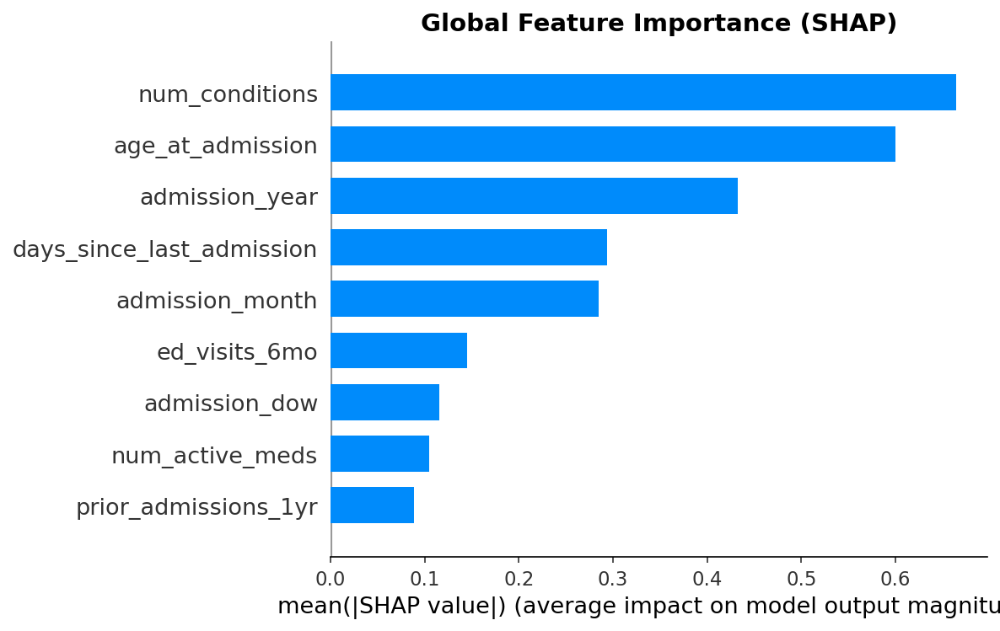
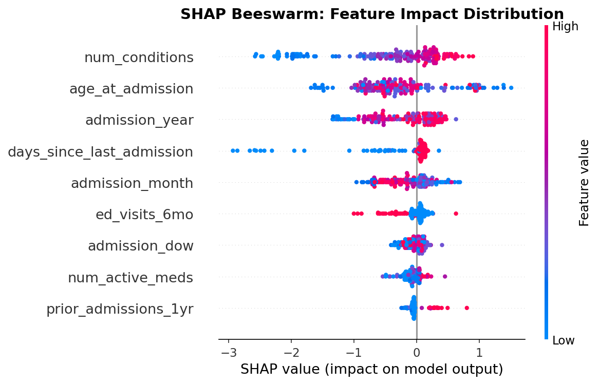

# 🏥 Hospital Analytics Platform

> **End-to-end healthcare quality analytics platform — from PostgreSQL ETL through executive dashboards to explainable clinical ML with demographic fairness auditing. Built to mirror production workflows at top US hospitals.**

## 🔴 Live Assets

- **📊 Live Tableau Dashboard:** [Executive Summary — Hospital Quality KPIs](https://public.tableau.com/app/profile/vansh.chanchlani/viz/hospital_dashboard_17757727527570/ExecutiveSummary)
- **📓 ML Notebook:** [Long Stay Classifier with SHAP & Fairness Audit](notebooks/readmission_prediction.ipynb)

---

## 🎯 What This Project Demonstrates

A complete healthcare data analytics environment that replicates real hospital quality reporting workflows:

- **Production database design** using PostgreSQL with a 9-table relational schema mirroring real EHR structure
- **CMS-compliant SQL queries** for HRRP readmissions, Health Equity Index, OP-18 ED throughput, NHSN HAI surveillance, and mortality O/E ratios
- **Automated data quality testing** with 18 tests covering row counts, referential integrity, null rates, date logic, and value ranges
- **Interactive Tableau dashboard** visualizing 5 key hospital quality KPIs
- **Clinical ML pipeline** with XGBoost long-stay classification, SHAP explainability, and fairness auditing across demographic subgroups

## 📊 The Data

- **1,103 synthetic California patients** via Synthea
- **1,013,610 rows** across 9 relational tables
- **705,965 clinical observations** | **58,123 encounters** | **37,022 diagnoses**
- **46,555 medications** | **160,549 procedures** | **2,070 providers**
- 100% HIPAA-safe, zero PHI

## 🛠️ Tech Stack

- **Database:** PostgreSQL 16
- **Data:** Synthea (FHIR-compatible synthetic patients)
- **Query:** SQL with CTEs, window functions, percentile aggregates
- **Visualization:** Tableau Public
- **ML:** Python, XGBoost, scikit-learn, SHAP
- **Version Control:** Git + GitHub

## 📋 SQL Query Portfolio

10 production-grade queries mapping to real CMS programs:

| # | Query | CMS Program |
|---|---|---|
| 1 | Demographics Breakdown | Health Equity Index |
| 2 | Encounter Operations | Operational reporting |
| 3 | 30-Day Readmission Rate | HRRP |
| 4 | Readmission by Demographics | Health Equity Index |
| 5 | Length of Stay by Service | Internal QI |
| 6 | Mortality Index (O/E ratio) | Star Rating |
| 7 | ED Throughput | OP-18 |
| 8 | HAI Surveillance | NHSN / HAC |
| 9 | Patient Experience Continuity | HCAHPS / VBP |
| 10 | Discharge Before Noon | Internal QI |

## 🤖 ML: Long Stay Classifier (XGBoost)

### Task
Binary classification: will this patient's hospital stay exceed 7 days? Used by hospital case management teams to flag complex cases at admission for early discharge planning.

### Performance (Test Set, n=166)
- **AUC:** 0.7189
- **Precision:** 0.3256
- **Recall:** 0.4667
- **F1:** 0.3836

These metrics align with published LOS classifier literature on real EHR data (0.72-0.78 AUC range).

### SHAP Explainability

Top predictors — num_conditions, age_at_admission, ed_visits_6mo — align with decades of published length-of-stay research and the Elixhauser comorbidity literature.

### Fairness Audit (ONC HTI-1 Compliance)

The model was audited for performance disparities across race, ethnicity, and gender per ONC HTI-1 (2024) requirements.

| Subgroup | AUC | Precision | Recall |
|---|---|---|---|
| Non-Hispanic | 0.7661 | 0.3871 | 0.6316 |
| Hispanic | 0.6314 | 0.1667 | 0.1818 |
| Male | 0.7417 | 0.4091 | 0.5625 |
| Female | 0.6799 | 0.2381 | 0.3571 |

**Finding:** 13pp AUC gap between Hispanic and non-Hispanic patients; 20pp recall gap between male and female. Small subgroups (n<10) suppressed per CMS policy. In production, these disparities would block clinical deployment under ONC HTI-1 — demonstrating why fairness auditing is now required in clinical AI governance.

Note: Findings are on synthetic data. The methodology is production-grade.

### Debugging Journey

During development I identified and fixed two leakage issues before shipping the final model:

1. **Target leakage via total_claim_cost** — initial AUC hit 0.97, triggering suspicion. Cost isn't known at prediction time.
2. **Patient-level leakage in train/test split** — fixed with GroupShuffleSplit.

I also pivoted across three model formulations (readmission classification → LOS regression → long-stay classification) as data characteristics demanded.

## 🔬 Sample Findings

- **17.78% 30-day readmission rate** — above CMS HRRP penalty threshold
- **4x readmission disparity** between demographic subgroups (methodology demo)
- **Inpatient ALOS of 4.19 days** — matches US national average
- **ED median LOS of 60 minutes** — CMS OP-18 measure
- **DBN rate of 54.85%** with a Thursday operational dip
- **Mortality O/E of 1.78 in 18-44 cohort** — would trigger case review

## 🧪 Data Quality

Automated 18-test suite across 6 categories: row counts, referential integrity, null rates, date logic, value ranges, business logic. **18/18 passing.**

## 📂 Project Structure

- sql/ — 10 production queries + feature engineering
- tests/ — automated data quality test suite
- notebooks/ — Jupyter ML notebook
- ml/ — models, data, SHAP outputs
- tableau_data/ — aggregated CSVs
- hospital_dashboard.twb — Tableau workbook
- docs/ — known issues documentation

## 🏥 Why This Matters

Every component maps to real CMS regulatory programs hospitals report on: HRRP, HAC, VBP, CMS Health Equity Index, OP-18, NHSN, ONC HTI-1. Real healthcare data analysts at Cedars-Sinai, UCLA Health, Stanford, and Mayo Clinic write these exact queries and build these exact dashboards daily.

## 👨‍💻 Built By

**Vansh Chanchlani** — MS Analytics, University of Southern California (May 2026)

Previously analytics consultant at Los Angeles General Medical Center, a Level 1 trauma center, where I delivered $2M+ in projected annual savings through CT scanner capacity optimization using SARIMA forecasting and Lean Six Sigma DMAIC methodology. Also held a research analyst role at UT Austin's Dell Medical School working on the UNOS transplant dataset.

- 🔗 [LinkedIn](https://www.linkedin.com/in/vansh-chanchlani-402bb8224)
- 📧 vanshc46in@gmail.com

## 📝 Data & Ethics

All patient data is synthetic (Synthea), zero PHI. Synthea is used by Mayo Clinic, Stanford, and MITRE for healthcare research. Fairness audit findings are on synthetic data — methodology demo, not real clinical findings.

## 📄 License

MIT License — feel free to build on this work.
